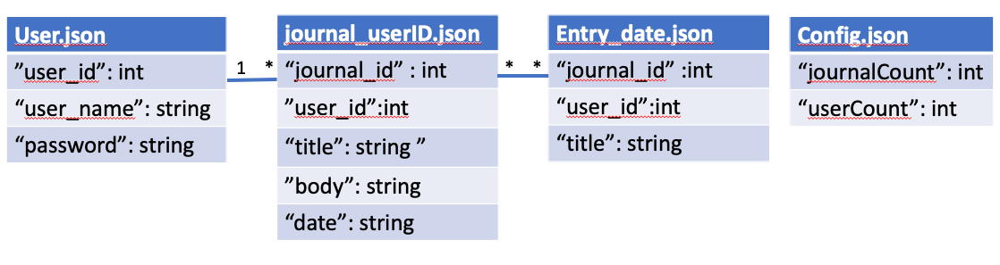

# Journal API

## Overview

The purpose of this project to assist in the creation of a new hypothetical Journaling app to store and display personal journal entries.

## Project details

1. The Journal app centers around journal entries. Journal entries at minimum contain:
    *  Title
    *  Date created
    *  Body of text

2. API support the following features of the journaling app:
    *  Recording a new journal entry, and the ability to save entries to disk
      -  for example, saving them as JSON in a simple text file.
    *  Retrieving entries that users have stored to disk
    *  List the contents of a journal entry
    *  Deleteing entries
    *  Support multiple users

3. Additionally, the API is able to support searching the list of entries based on title, or a date range. Some considerations:
    *  Searching may take several seconds. The UI expects to be able to receive and display intermediate results until final results are availible.
    *  Users may be in different time zones.


## Communications Protocol: WebSocket

WebSocket is a computer communications protocol, providing full-duplex communication channels over a single TCP connection.To communicate and display Real-Time Data, WebSocket is one of the best choices. The journal API use websocket to communicate.


## High Level System Design

At a high level, the journal system needs multiple application servers to serve all these requests with load balancers in front of them for traffic distributions. On the backend, non-SQL databases can store all the new jornals and can support a huge number of reads and writes.


The system has neither database nor application server on this version. So I wrote two API, to demostrate how it works.

  - **Service_API** : provides the service on the server side and store the journals in server disk.
    + libserver_api.a 
    + server_api.h
  - **Client_API** : provides the communication functions for users to write and read journals.
    + libclient_api.a
    + client_api.h


## File Schema

All the journal entries are stored in server in json format.

   - **user.json** : stores all users
   - **journal_userID.json**: stores all journals. Every user has a journals file.
   - **entry_date.json**: stores all journal entries. Every date has a journal entires file. This file can provide the intermediate results while the final results are not available. The UI can use journal_id and user_id to get detail journal info(body of text).
   - **config.json**: stores how many journal already been generated and how many user registed.




## API Founctions

Server_API and Client_API both have the following functions. except ```journal_service() ``` only used on server side.

I have wrote two test programs: `./server_api_test`, `./client_api_test` ,`./client_api_test_multi_user`for test these API functions on both server side and client side.

```
/*
Add new user
@return :json format user_id
*/
json cmdAddUser(json jdata);

/*
Check if user exist or not
@return : json format user_id / 0 if not exist
*/
json cmdCheckUser(json jdata);

/*
Add new journal
@return :json format journal_id
*/
json cmdAddJournal(json jdata);

/*
Modify journal
@return : json format result(true:1 /false:0)
*/
json cmdModJournal(json jdata);

/*
Delete journal
@return : json format result(true:1 /false:0)
*/
json cmdDelJournal(json jdata);

/*
Get a journal
@return : journal data (JSON)
*/
json cmdGetJournal(json jdata);

/*
Get journals
@return : journals data (JSON)
*/
json cmdGetJournalsByUser(json jdata);

/*
Get journal entries
@return : journal data (JSON)
*/
json cmdGetJournalsByDates(json jdata);

/*
* handle WebSocket journal service
*/
int journal_service();
```


## Environment setup

* cmake >= 3.5
 * All OSes: [click here for installation instructions](https://cmake.org/install/)
* make >= 4.1(mac, linux), 3.81(Windows)
  * Linux: make is installed by default on most Linux distros
  * Mac: [install Xcode command line tools to get make](https://developer.apple.com/xcode/features/)
  * Windows: [Click here for installation instructions](http://gnuwin32.sourceforge.net/packages/make.htm)
* gcc/g++ >= 5.4
  * Linux: gcc / g++ is installed by default on most Linux distros
  * Mac: same deal as make - [install Xcode command line tools]((https://developer.apple.com/xcode/features/)
  * Windows: recommend using [MinGW](http://www.mingw.org/)
* [uWebSockets](https://github.com/uWebSockets/uWebSockets)
  * Run either `./install-mac.sh` or `./install-ubuntu.sh`.
  * If you install from source, checkout to commit `e94b6e1`, i.e.
    ```
    git clone https://github.com/uWebSockets/uWebSockets 
    cd uWebSockets
    git checkout e94b6e1
    ```
    Some function signatures have changed in v0.14.x. See [this PR](https://github.com/udacity/CarND-MPC-Project/pull/3) for more details.


## Basic Build Instructions

1. Clone this repo.
2. Make a build directory: `mkdir build && cd build`
3. Compile: `cmake .. && make`
4. Run it: `./server_api_test`, `./client_api_test`, `./client_api_test_multi_user`. 


## Code files

| File tree | | | Functions |
| ----------- | ----------- | ----------- | ----------- |
| journal | / include |/ client_api.h | client_api header file |
| | | server_api.h | server_api header file |
| | | journal.h | journal related functions header file |
| | | utils.h | utilities functions header file |
| | | json.h | JSON for Modern C++ header file |
| |/ src |/ client_api.cpp | client_api functions |
| | | server_api.cpp | server_api functions |
| | | test_client_api.cpp | test main function for client_api |
| | | test_client_api_multi_user.cpp | test main function for client_api |
| | | test_server_api.cpp | test main function for server_api |
| | | utils.cpp | utilities functions |
| |/ build |/ client_api_test | test program for client_api |
| | |/ server_api_test |  test program for server_api |
| | |/ *.json files | all the stored json files |
| |/ doc |/ readme.md or pdf | readme and documents |
| |/ CMakeLists.txt | | cmake file for build |


## Test Cases:

You can run those test case use the `./client_api_test` , `./client_api_test_multi_user`program. The `./server_api_test` will send the data accordingly.

  - **Add User**: After add user. The `user.json` file will be created and the user will be added into the file.
```
  int u_id = addUser("Steven", "pw");
  cout << "u_id:" << u_id << endl;
```

  - **Add Journal**: After add journal. The `journal_userID.json`, `entry_Date.json` files will be created. The journal will be added into the journal file, and the brief entry info will be added into the entry file.
```
  int j_id = addJournal(u_id,"title_1","body_1");
  j_id = addJournal(u_id,"title_2","body_2");
```

  - **Check User**: To delete or modify journal, you have to verify the user first by calling `checkUser()`. If the password is correct the user_id will be sent from server. 
```
  u_id = checkUser("tina", "pw");
  cout << "u_id:" << u_id << endl;
```

  - **Modify Journal**: After verified the user. You can modify the journal by calling `modJournal()`.
```
  modJournal(3, 2, "mod title_3", "mod body_3"); //journal_id, user_id
  json j = getJournal(3, u_id); //j_id,u_id
  cout << j << endl;
```

  - **Delete Journal**: After verified the user. You can delete the journal in `journal_userID.json` by calling `delJournal()`. The brief entry file in `entry_Data.json` will be deleted as well.
```
delJournal(5, u_id); //journal_id, user_id
```

  - **Query Journal**: 
    + **By User_ID**:You can get call journals by user_id. The return data is in json format.
```
  json j2 = getJournalsByUser(2);
  cout << j2 << endl;
```

    + **By Dates**: You can get brief journal entries by to dates(YYYY\MM\DD) as the intermediate results. The UI can use the `journal_id` and `user_id` from the brief entries data to get the body of text.
```
  json j3 = getJournalsByDates("2020-5-21","2020-5-31");
  cout << j3 << endl;
```

## Defult test data
After runing the following test test cases in `./client_api_test`. The `*.json` files will be generated in server disk.
```
  int u_id = addUser("Steven", "pw");
  cout << "u_id:" << u_id << endl;

  int j_id = addJournal(u_id,"title_1","body_1");
  j_id = addJournal(u_id,"title_2","body_2");

  u_id = addUser("tina", "pw");
  cout << "u_id:" << u_id << endl;
  
  j_id = addJournal(u_id,"title_3","body_3");
  j_id = addJournal(u_id,"title_4","body_4");
  j_id = addJournal(u_id,"title_5","body_5");
  cout << "j_id:" << j_id << endl;

  modJournal(3, 2, "mod title_3", "mod body_3");
  json j = getJournal(3, u_id); //j_id,u_id
  cout << j << endl;

  u_id = checkUser("tina", "pw");
  cout << "u_id:" << u_id << endl;

  delJournal(5, u_id); //j_id,u_id

  json j2 = getJournalsByUser(2);
  cout << j2 << endl;

  json j3 = getJournalsByDates("2020-5-21","2020-5-31");
  cout << j3 << endl;
```

The `*.json` files.

  - **config.json** :
```
{
    "journalCount": 5,
    "userCount": 2
}
```

  - **user.json** :
```
 [
    {
        "password": "pw",
        "user_id": 1,
        "user_name": "Steven"
    },
    {
        "password": "pw",
        "user_id": 2,
        "user_name": "tina"
    }
]
```

  - **journal_1.json** :
```
[
    {
        "body": "body_1",
        "date": "2020-6-1T9:16:19Z",
        "journal_id": 1,
        "title": "title_1"
    },
    {
        "body": "body_2",
        "date": "2020-6-1T9:16:19Z",
        "journal_id": 2,
        "title": "title_2"
    }
]
```

  - **journal_2.json** :
```
[
    {
        "body": "mod body_3",
        "date": "2020-6-1T9:16:19Z",
        "journal_id": 3,
        "title": "mod title_3"
    },
    {
        "body": "body_4",
        "date": "2020-6-1T9:16:19Z",
        "journal_id": 4,
        "title": "title_4"
    }
]
```

  - **entry_2020-05-31** :
```
[
    {
        "journal_id": 1,
        "title": "title_1",
        "user_id": 1
    },
    {
        "journal_id": 2,
        "title": "title_2",
        "user_id": 1
    },
    {
        "journal_id": 3,
        "title": "title_3",
        "user_id": 2
    },
    {
        "journal_id": 4,
        "title": "title_4",
        "user_id": 2
    }
]
```

## Multi-user test case:
I worte a client test program `./client_api_test_multi_user` for multi-user test. You can open multi terminal window test run this program.(The test case user_id are 1,2,3.)

Cause the communication protocal is WebSocket. It can support real time access, means each API function will create socket to do the handshake then release the resource. So the deadlock is prevented. But if there's a large amount of users, the message queue will be too long. To sove this program, we can either use multithreading or add more application servers.

Cause user may be in different time zone, so the data stored in server used the UTC time zoom. Client app can change the time back to local time accordingly.

## Points of failure & Areas of Improvement

 - **Multithreading**:
To suppourt multiple users, the server should has multithreading service. I will keep on implementing this feature soon.

 - **Store_photo**:
A journal should include pictures or videos. I will add this feature on next version.

 - **Data_Base**:
Use file system only is not very efficient. The API should be able to store data in SQL or non-SQL data base. It will be better to scale the system.  

## Thanks
Thanks the projects I've done before while I was studying self-driving car at Udacity. The `JSON for Modern C++ ` and `uWebSockets` resources were found from Udacity. Thank you for giving me the opportunity to implement this project. It is not perfect yet, but I will try my best to complete it. Please let me know if there's any misunderstanding. 
